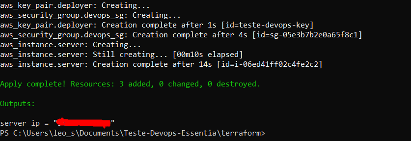
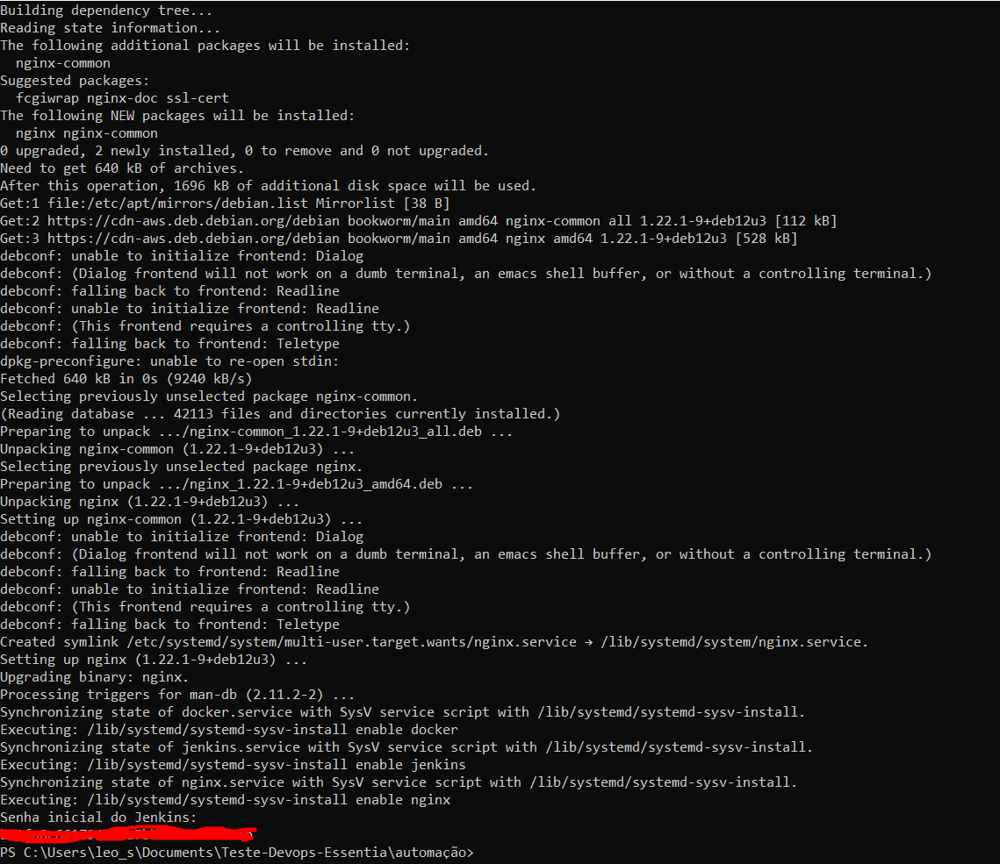
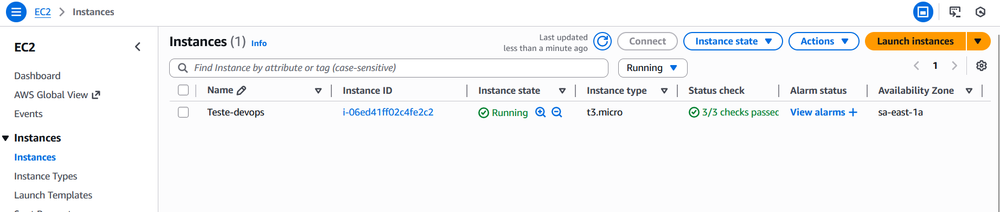
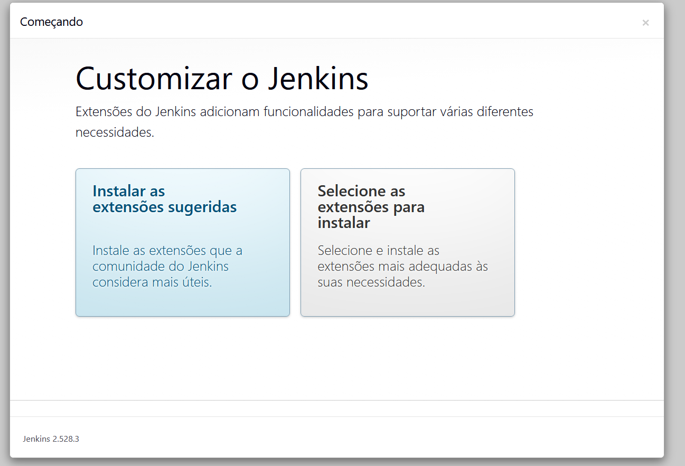
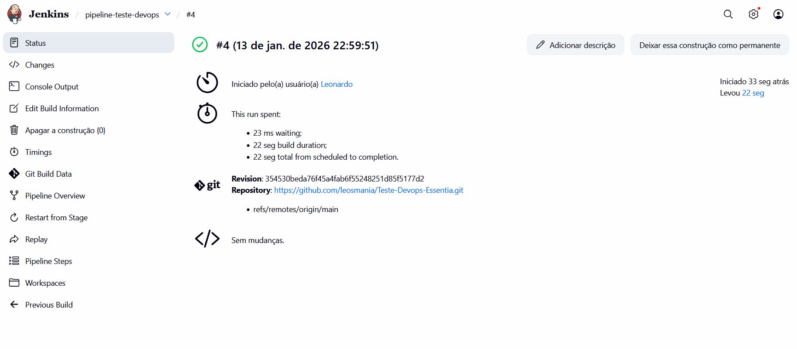
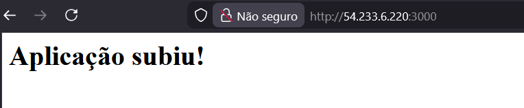
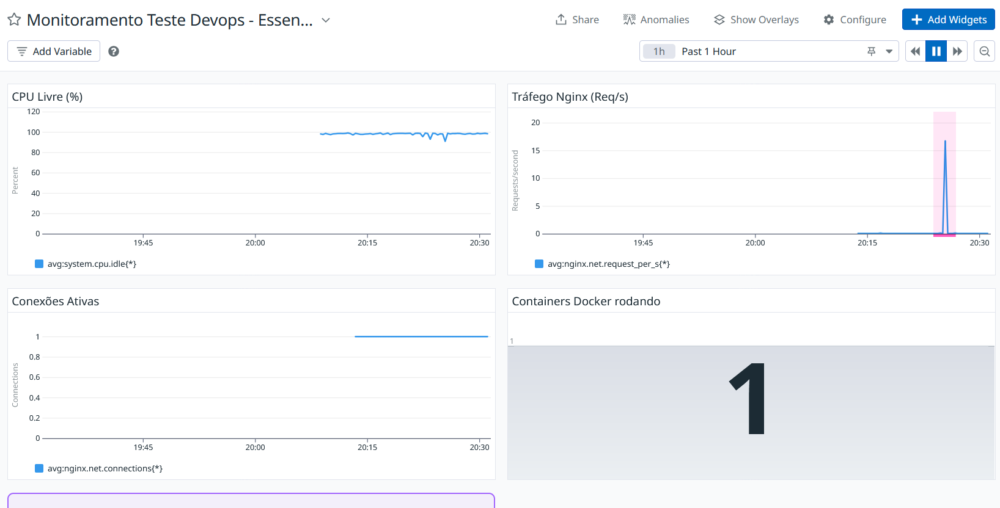
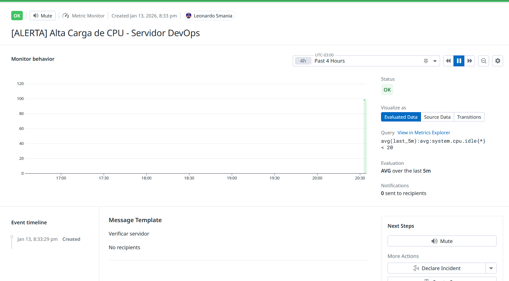

# Teste Técnico DevOps Pleno – Essentia
Repositório da solução desenvolvida para o teste técnico para a vaga de Devops Pleno da Essentia Group.

---

## Visão geral da arquitetura

A solução foi criada de forma simples e funcional, simulando um cenário real de uso.
Executando desde o provisionamento da infra até o monitoramento da aplicação.

### 1. Provisionamento da Infraestrutura (Terraform)

- **Ambiente:** AWS  
- **Recurso principal:** EC2 `t3.micro`
- **Segurança:** Security Group configurado de forma restritiva, liberando apenas as portas necessárias:
  - SSH (22)
  - HTTP (80)
  - Jenkins (8080)
  - Aplicação (3000)

**Decisão técnica:**  
Usei `outputs` no Terraform para expor o IP público da instância automaticamente, facilitando para executar os scripts de configuração e ajustes.

---

### 2. Configuração do Servidor (`setup.sh`)

Script criado para executar a configuração automática após o provisionamento, preparando o servidor.

- **Gerenciamento de recursos:**  
  Criação automática de **2GB de swap**, devido à limitação de memória da instância `t3.micro`, especialmente durante builds Docker.
- **Runtime:**  
  Utilização do **Amazon Corretto 21**, devido a compatibilidade da versão mais recente do Jenkins e seus plugins.
- **Permissões:**  
  Configuração do usuário no grupo `docker`, permitindo execução de pipelines sem a necessidade de `sudo`.
- **Observabilidade desde o início:**  
  Configuração automática do Nginx com `stub_status` exposto na porta 81, para a coleta de métricas pelo Datadog.

---

### 3. Pipeline de CI/CD (Jenkins)

O pipeline foi implementado utilizando um **Jenkinsfile declarativo**, com foco em simplicidade e clareza:

- **Fluxo:** Build → Dockerização → Deploy
- **Isolamento:**  
  A aplicação roda em container Docker, desacoplada do host.
---

### 4. Observabilidade (Datadog)

O monitoramento foi configurado da seguinte maneira:

- **Host:**  
  CPU, memória e disco.
- **Aplicação / Web Server:**  
  Métricas de tráfego e conexões ativas do Nginx.
- **Alertas:**  
  Monitor proativo para consumo de CPU, com alerta configurado para quando o tempo ocioso ficar abaixo de 20%.

---

## Evidências de execução

### Provisionamento via Terraform


### Script de configuração inicial


### Instância criada na AWS


### Instalação padrão do Jenkins


### Pipeline de CI/CD com sucesso


### Aplicação em funcionamento


### Dashboard de monitoramento


### Configuração de alerta (CPU)


---

## Como executar o projeto

### Pré-requisitos

- Terraform instalado
- Credenciais da AWS configuradas localmente (`aws configure`)
- Chave SSH criada

---

### Passo 1: Provisionar a infraestrutura

Acesse a pasta `terraform` e execute:

```bash
terraform init
terraform apply
```

Ao final, copie o IP Público gerado (Output).

### Passo 2: Configurar o servidor

Na raiz do projeto, envie e execute o script de automação (substitua pelo IP gerado):


```bash

# Enviar script

scp -o StrictHostKeyChecking=no -i "terraform/id_rsa_aws_test" setup.sh admin@SEU_IP_AQUI:/home/admin/

# Executar instalação

ssh -o StrictHostKeyChecking=no -i "terraform/id_rsa_aws_test" admin@SEU_IP_AQUI "chmod +x setup.sh && ./setup.sh"
```

### Passo 3: Acesso aos serviços
-   **Jenkins:** `http://SEU_IP_AQUI:8080` 
A senha inicial do Jenkins será mostrada ao finalizar o script inicial    
-   **Aplicação:** `http://SEU_IP_AQUI:3000`
Irá retornar uma página simples de sucesso

